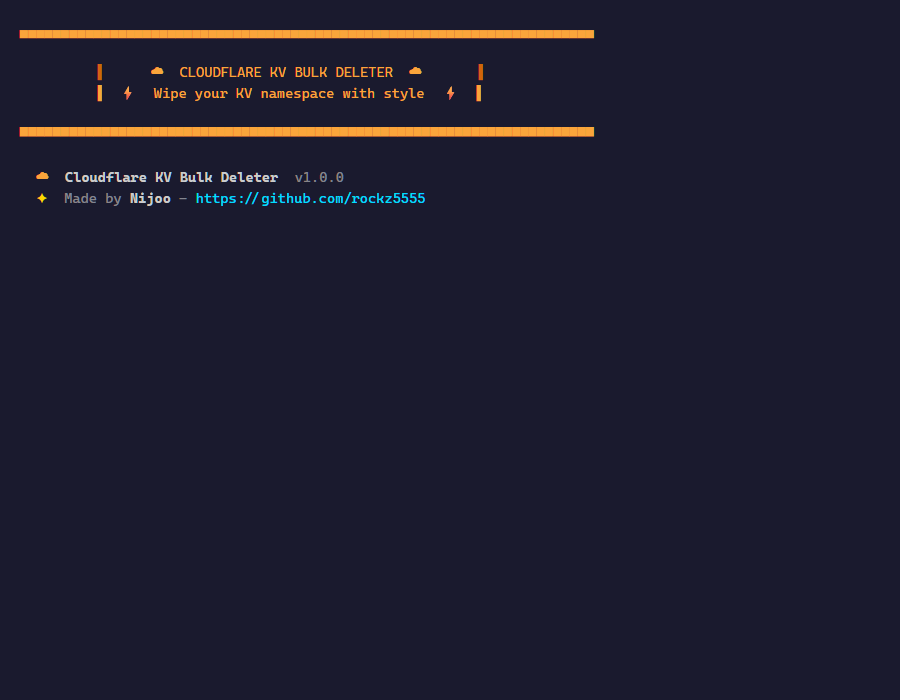
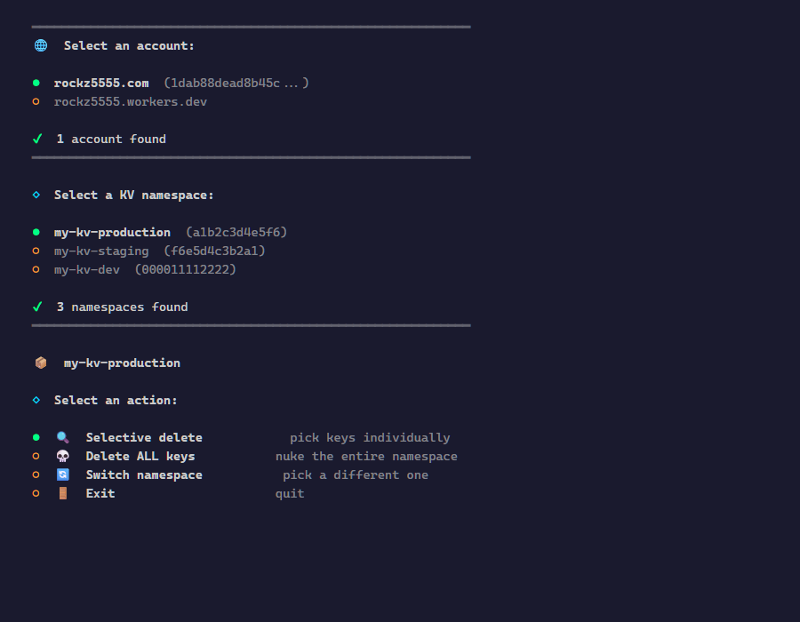
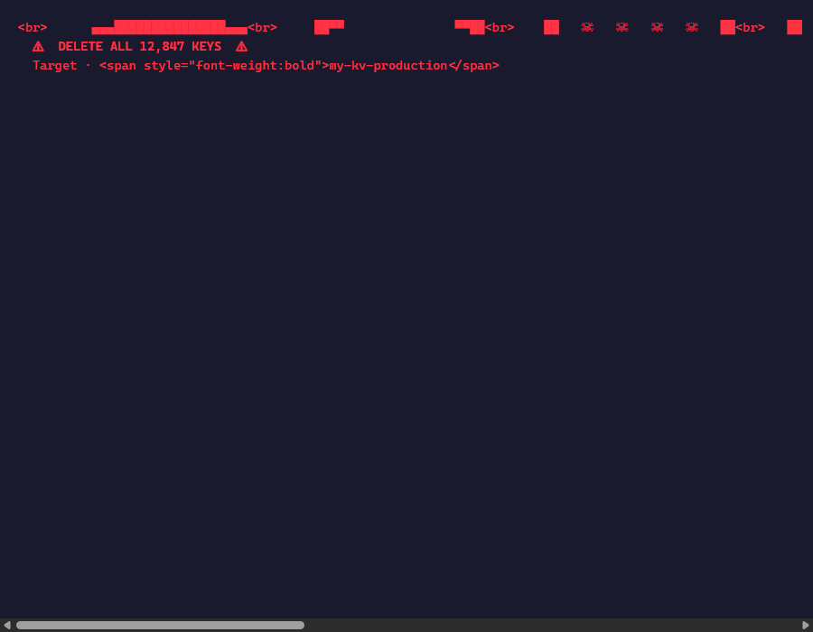
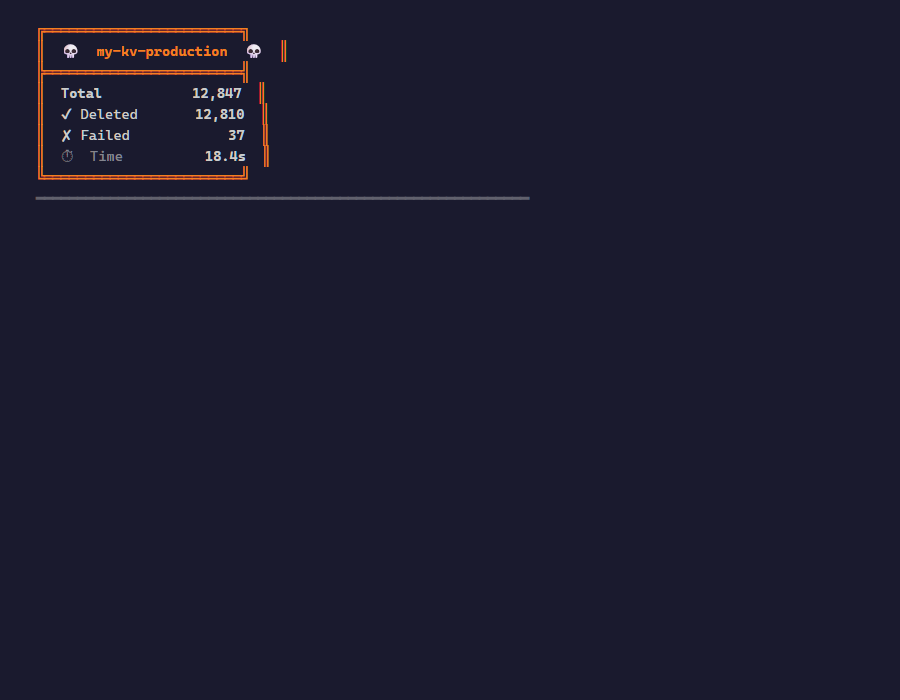

# ☁️ Cloudflare KV Bulk Deleter

> Blazing-fast, interactive KV namespace cleaner with a gorgeous CLI experience.

[](https://www.npmjs.com/package/cloudflare-kv-bulk-deleter)
[](LICENSE)
[](https://nodejs.org)
[](https://github.com/rockz5555/cloudflare-kv-bulk-deleter/pulls)

---

## ✨ Features

- **Bulk delete** all keys in a Cloudflare KV namespace — fast.
- **Interactive UI** — gradient banners, progress bars, real-time counters.
- **Safe by default** — double confirmation before deletion.
- **Single-command installer** — double-click and go.
- **Portable or installed** — run from anywhere or install to a folder.

---

## 🚀 Quick Start

### Prerequisites

- [Node.js](https://nodejs.org) 18+ (installer will prompt you if missing)
- A Cloudflare account with a [KV namespace](https://developers.cloudflare.com/kv/)
- An [API token](https://dash.cloudflare.com/profile/api-tokens) with `KV:Write` permission

### Run

**One-liner (no install):**
```bash
npx cloudflare-kv-bulk-deleter
```

**Windows — double-click `start.cmd`** (handles install + launch).

**Clone & run:**
```bash
git clone https://github.com/rockz5555/cloudflare-kv-bulk-deleter.git
cd cloudflare-kv-bulk-deleter
npm install
node index.mjs
```

---

## 🖼️ Screenshots

| Banner | Account & Namespace |
|---|---|
|  |  |

| Danger zone | Results panel |
|---|---|
|  |  |

| Exit screen |
|---|
|  |

---

## 🔧 Configuration

The first time you run the tool, it will ask for:

| Required | Notes |
|---|---|
| **API Token** | [Dashboard → API Tokens](https://dash.cloudflare.com/profile/api-tokens) — needs `Account:Read + KV:Write` permissions |
| — | **Account** is auto-detected. Pick if you have multiple. |
| — | **Namespace** is auto-detected. Pick from the list. |

Token is saved to `~/.cloudflare-kv-deleter.json` for reuse.

---

## 🖥️ Usage

### App Flow

| Step | What happens |
|---|---|
| **Token** | Prompted on first run — saved to `~/.cloudflare-kv-deleter.json` |
| **Account** | Auto-fetched via API. Pick if you have multiple. |
| **Namespace** | Auto-fetched via API. Pick from the list. |
| **Main menu** | `Selective delete` / `Nuke all` / `Switch namespace` / `Exit` |
| **Selective** | `space` to toggle keys · `enter` to confirm deletion |
| **Nuke** | Skull warning → `NUKE THE NAMESPACE?` confirm → type-style confirmation |
| **Results** | Total keys · Deleted · Failed · Elapsed time |
| **Loop** | `Do another operation?` — stays open until you choose Exit |

---

## 📁 Project Structure

```
cloudflare-kv-bulk-deleter/
├── index.mjs          # Main application (all logic + UI)
├── package.json       # Dependencies
├── start.cmd          # Double-click launcher
├── start.ps1          # Installer + launcher (PowerShell)
├── screenshots/       # App screenshots
│   ├── screenshot_banner.png
│   ├── screenshot_menu.png
│   ├── screenshot_danger.png
│   ├── screenshot_results.png
│   └── screenshot_exit.png
├── README.md          # This file
└── LICENSE
```

---

## 🛠️ Tech Stack

- **Runtime** — Node.js 18+
- **CLI UI** — [chalk](https://github.com/chalk/chalk) v4, [gradient-string](https://github.com/bokub/gradient-string), [@clack/prompts](https://github.com/natemoo-re/clack)
- **API** — Cloudflare API v4 (`DELETE /accounts/:id/storage/kv/namespaces/:id/bulk`)
- **Platform** — Windows (primary), cross-platform capable

---

## 🤝 Contributing

PRs welcome! Here's how:

1. Fork the repo
2. Create a feature branch (`git checkout -b feat/awesome`)
3. Commit your changes (`git commit -m 'feat: add awesome thing'`)
4. Push (`git push origin feat/awesome`)
5. Open a Pull Request

Please keep the code style consistent — no semicolons, no trailing commas, ES module syntax.

---

## 📄 License

MIT © Nijoo

---

*Made with ☕ and ❤️ for the Cloudflare community.*
